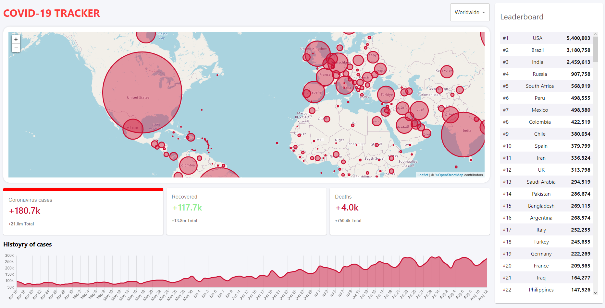

# React Covid-19 tracker

A simple covid-19 tracker using the https://disease.sh and a React front-end app.

Inspired by [ClverProgrammer](https://www.youtube.com/watch?v=cF3pIMJUZxM).

## Usage

Clone this repository and run:

#### `npm install`

to install all the npm packages in packages.json. And then run:

### `npm start`

to start the react frond-end app in development mode on port 8080.
If you want to deploy run:

### `npm run build`

## Deploy

Deployed in [Covid-tracker](http://piserver.ddns.net:8080/react-covid-track)

## Example

     

